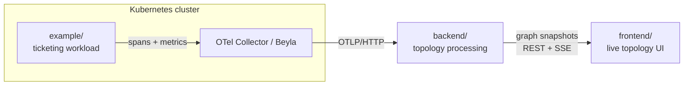

# KubeVisor

KubeVisor turns OpenTelemetry traces and Kubernetes signals into a **live,
understandable service-communication graph**. It ingests telemetry from workloads
running in a cluster, infers the service topology, aggregates rolling per-edge
metrics (request rate, latency, errors), and renders the result as an interactive
graph in the browser.

This is the management repository for the whole project. The three components live
side by side as subfolders, each retaining its own history, build, and docs.

## Repository layout

| Folder | What it is | Stack |
| --- | --- | --- |
| [backend/](backend/) | Telemetry ingestion → normalization → topology inference → rolling aggregation → graph snapshot API (REST + SSE), with 24h persistence | Java 21, Spring Boot, Maven |
| [frontend/](frontend/) | Renders processed graph snapshots as a column-based topology graph; styles edges by load / latency / errors; scrubs through history | TypeScript, Vite, React |
| [example/](example/) | Demo ticketing workload (auth / order / ticket services) that generates realistic service-to-service traffic and OpenTelemetry traces | Java, Spring Boot, Maven |

## How it fits together



- The **example** workload emits spans and network/resource signals.
- The **backend** is the source of truth: it consumes OTLP, builds the live graph,
  aggregates edge metrics, persists a rolling 24h window, and publishes UI-ready
  snapshots.
- The **frontend** only renders processed snapshots — it never ingests or
  recomputes telemetry.

## Quick start

Each component runs independently. See the per-folder docs for details.

```bash
# Backend (graph API on :8080)
cd backend && mvn spring-boot:run

# Frontend (Vite dev server)
cd frontend && npm install && npm run dev

# Example workload (multi-module Maven build)
cd example && mvn package
```

## Documentation

- Backend: [backend/docs/README.md](backend/docs/README.md)
- Frontend: [frontend/docs/README.md](frontend/docs/README.md)
- Example workload: [example/README.md](example/README.md)

## License

[MIT](LICENSE) © 2026 Elnur Alimirzayev
