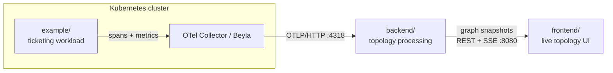

# KubeVisor

KubeVisor turns OpenTelemetry traces and Kubernetes signals into a **live,
understandable service-communication graph**. It ingests telemetry from workloads
running in a cluster, infers the service topology, aggregates rolling per-edge
metrics (request rate, latency, errors), and renders the result as an interactive
graph in the browser.

This is the management repository for the whole project. The three components live
side by side as subfolders, each retaining its own history, build, and docs.

## Repository layout

| Folder | What it is | Stack |
| --- | --- | --- |
| [backend/](backend/) | Telemetry ingestion → normalization → topology inference → rolling aggregation → graph snapshot API (REST + SSE), with 24h persistence | Java 21, Spring Boot, Maven |
| [frontend/](frontend/) | Renders processed graph snapshots as a column-based topology graph; styles edges by load / latency / errors; scrubs through history | TypeScript, Vite, React |
| [example/](example/) | Demo ticketing workload (auth / order / ticket services) that generates realistic service-to-service traffic and OpenTelemetry traces | Java, Spring Boot, Maven |

## How it fits together



- The **example** workload emits spans and network/resource signals.
- The **backend** is the source of truth: it consumes OTLP, builds the live graph,
  aggregates edge metrics, persists a rolling 24h window, and publishes UI-ready
  snapshots.
- The **frontend** only renders processed snapshots — it never ingests or
  recomputes telemetry.

## Getting started

Deploy the whole stack (backend, frontend UI, PostgreSQL, and an OTel Collector)
into a Kubernetes cluster with the bundled [Helm chart](backend/helm/kubevisor).

**Prerequisites:** a Kubernetes cluster, `kubectl`, [Helm](https://helm.sh) 3+,
and Docker. The steps below use [Minikube](https://minikube.sigs.k8s.io) and build
the images straight into the cluster (no registry required).

```bash
# 1. Start a cluster
minikube start --cpus=4 --memory=4096

# 2. Build the images into the cluster's Docker daemon
eval $(minikube docker-env)
( cd backend  && mvn -q -DskipTests package && docker build -t kubevisor-backend:0.1.0 . )
( cd frontend && docker build -t kubevisor-frontend:0.1.0 . )

# 3. Install the chart — creates and owns the `kubevisor` namespace
helm install kubevisor ./backend/helm/kubevisor

# 4. Open the topology UI
kubectl -n kubevisor port-forward svc/kubevisor-frontend 8080:80
# → http://localhost:8080
```

The image tags default to the chart's `appVersion` (`0.1.0`), matching the tags
built above. Check status with `kubectl -n kubevisor get pods`.

### Sending it telemetry

The backend needs OpenTelemetry data to draw edges. Either point your workloads'
OTLP exporters at the bundled collector:

```
http://kubevisor-otel-collector.kubevisor.svc.cluster.local:4318
```

…or, if your cluster already runs a collector, disable the bundled one
(`--set otelCollector.enabled=false`) and export OTLP/HTTP from your collector to
the backend at `kubevisor-backend.kubevisor.svc.cluster.local:4318`.

### Common options

```bash
# Use an external PostgreSQL instead of the bundled one
helm install kubevisor ./backend/helm/kubevisor \
  --set postgres.enabled=false \
  --set externalDatabase.host=my-postgres --set externalDatabase.existingSecret=my-db-secret

# Enable Beyla (passive eBPF network-flow capture for un-instrumented workloads),
# pinned to Linux nodes
helm upgrade kubevisor ./backend/helm/kubevisor --reuse-values \
  --set beyla.enabled=true --set 'beyla.nodeSelector.kubernetes\.io/os=linux'

# Remove everything
helm uninstall kubevisor
```

See the [chart README](backend/helm/kubevisor/README.md) for the full list of
configurable values.

## Local development

Prefer to run a single component on your machine? Each one runs independently:

```bash
# Backend (graph API on :8080)
cd backend && mvn spring-boot:run

# Frontend (Vite dev server)
cd frontend && npm install && npm run dev

# Example workload (multi-module Maven build)
cd example && mvn package
```

## Documentation

- Backend: [backend/docs/README.md](backend/docs/README.md)
- Frontend: [frontend/docs/README.md](frontend/docs/README.md)
- Example workload: [example/README.md](example/README.md)

## License

[MIT](LICENSE) © 2026 Elnur Alimirzayev
