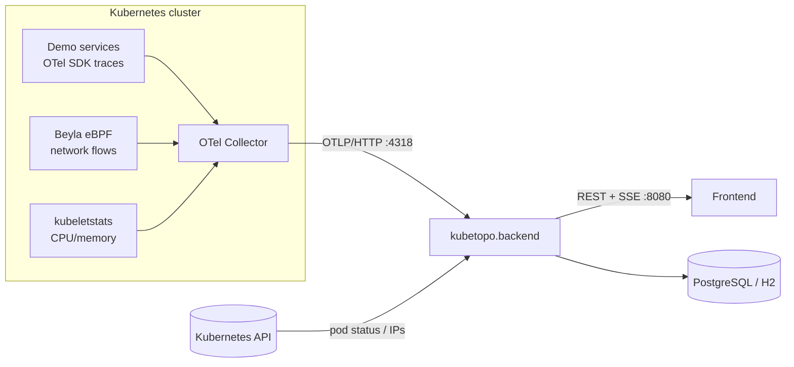

# Architecture

## System context

`kubetopo.backend` runs in the **observability plane**, outside the business
request path. It is **telemetry-source agnostic**: it accepts OTLP/HTTP from any
OpenTelemetry Collector in any Kubernetes cluster, exposing ingestion on the
standard OTLP/HTTP port **4318** (separate from the graph API on 8080). It
integrates with two sibling repositories:

- A **demo workload** (ticketing system: `auth-service`, `order-service`,
  `ticket-service`, plus databases) that emits OpenTelemetry telemetry — one
  example source among many, not a hard dependency.
- A **frontend** that renders the live topology graph and edge metrics in the browser.

Telemetry reaches the backend through an **OpenTelemetry Collector** and the
**Beyla** eBPF DaemonSet. The backend never injects agents into monitored
workloads; all collection is passive.

## Package layout

The codebase keeps ingestion, parsing, normalization, topology, aggregation, and
publishing as separate packages under `com.kubetopo`.

| Package | Responsibility | Key classes |
| --- | --- | --- |
| `ingestion` | Receive OTLP/HTTP payloads; orchestrate the pipeline | `OtlpTraceIngestionController`, `OtlpMetricsIngestionController`, `IngestionPipeline`, `NetworkFlowProcessor`, `ResourceMetricsProcessor` |
| `parsing` | Parse raw OTLP JSON into `ParsedSpan` records | `SpanParser`, `ParsedSpan` |
| `normalization` | Convert `ParsedSpan` → `InteractionEvent` | `SpanNormalizer` |
| `topology` | Resolve source/target workloads and node types; learn pod IPs | `TopologyResolver`, `PodIpResolver`, `KubernetesPodWatcher` |
| `aggregation` | Maintain in-memory graph state and rolling metrics | `GraphStateManager` |
| `api` | REST endpoints and SSE live updates | `GraphController`, `GraphUpdatePublisher` |
| `model` | Internal domain models and frontend DTOs | `Node`, `Edge`, `InteractionEvent`, `GraphSnapshot`, `PodInstance`, enums, `*Dto` |
| `cleanup` | Remove stale nodes and edges | `StaleGraphCleaner` |
| `persistence` | Snapshot storage, retention, and history/timeline queries | `SnapshotPersistenceService`, `GraphSnapshotRepository`, `GraphSnapshotEntity`, `SnapshotRetentionCleaner`, `RestartTimelineService`, `NodeMetricsTimelineService`, `NamespaceRequestTimelineService` |
| `support` | Configuration, utilities, pod status scraping, OpenAPI/web config | `KubetopoProperties`, `PodStatusScraper`, `OpenApiConfig`, `WebConfig` |

The application entry point is `KubetopoBackendApplication`. It is a standard
`@SpringBootApplication` with `@EnableScheduling` (cleanup, persistence, and
publishing run on scheduled cadences).

## Data flow

### Trace path (`POST /v1/traces`)

1. `OtlpTraceIngestionController` accepts OTLP/HTTP JSON (gzip supported),
   deserializes it, and hands the payload to `IngestionPipeline`.
2. `SpanParser` flattens `resourceSpans → scopeSpans → spans` into `ParsedSpan`.
3. For each span, `IngestionPipeline`:
   - learns `k8s.pod.ip → service.name` mappings via `PodIpResolver`,
   - registers the emitting service as a node,
   - calls `SpanNormalizer` to produce an `InteractionEvent`.
4. `SpanNormalizer` uses `TopologyResolver` (client spans resolve the **target**;
   server spans resolve the **caller**) to build a directed edge.
5. `GraphStateManager.registerEdge` creates skeleton nodes/edges;
   `recordTraffic` records latency/error into the edge's current-second accumulator.
6. The controller calls `GraphUpdatePublisher.notifyIfChanged()` to push SSE updates.

### Metrics path (`POST /v1/metrics`)

The metrics endpoint multiplexes two metric families:

- **Beyla network flows** (`beyla.network.flow.bytes`) → `NetworkFlowProcessor`
  derives topology edges from `k8s.src.owner.name → k8s.dst.owner.name`.
- **kubeletstats resource metrics** (CPU/memory) → `ResourceMetricsProcessor`
  updates per-pod and per-workload CPU/memory utilization on nodes.

### Publish path

- `GraphUpdatePublisher` holds the SSE subscriber list and broadcasts
  per-namespace `GraphSnapshot[]`. It pushes on change (`notifyIfChanged`) and on
  a fixed cadence so clients observe time-based metric decay.
- It also persists snapshots on the same cadence for history replay.

## State, threading, and namespaces

- **In-memory state** lives in `GraphStateManager` as two `ConcurrentHashMap`s
  (`nodes`, `edges`). A `dirty` `AtomicBoolean` lets the publisher detect changes.
- **Per-edge metrics** are **instantaneous per-second** values in `Edge`,
  bucketed by **span event time** (not arrival time): a lock-guarded pair of
  adjacent one-second accumulators (current + previous) reports the most recently
  **completed** second. Event-time bucketing spreads each ~5 s export batch back
  across the real seconds in which requests happened, and the last value is
  **held** between batches, decaying to zero only after no traffic for
  `traffic-hold-seconds` (default 10 s, configurable) — together these keep the
  load reading stable instead of flickering on and off between flushes. (Lower
  `traffic-hold-seconds` to make load fade out sooner after traffic stops; it
  must stay above the telemetry export interval to avoid flicker.)
- **Snapshots are namespace-scoped**: `buildSnapshots()` groups edges by the target
  node's namespace and emits one `GraphSnapshot` per namespace. Cross-namespace and
  external traffic collapse into synthetic `internal` / `external` source nodes so
  each snapshot stays namespace-local.

## Design principles

- Keep OpenTelemetry-specific parsing isolated from internal domain models.
- Prefer plain Java collections and simple rolling-window logic over heavy abstractions.
- Favor deterministic behavior to aid debugging.
- Rolling-window aggregation over raw-event persistence; do not persist every raw span.
- Design so future persistence/features can be added without rewriting the pipeline.
