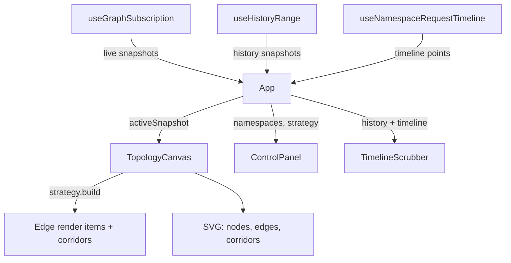

# Architecture

## System context

```mermaid
flowchart LR
    telemetry[Example services\nauth / order / ticket] -->|telemetry| backend[Backend\naggregation + history]
    backend -->|GraphSnapshot[]| frontend[KubeTopo]
    frontend -->|renders| user[Observability UI]
```

- A **separate example project** generates telemetry from demo services.
- A **separate backend** aggregates telemetry into graph snapshots and stores
  history. It exposes REST + SSE endpoints.
- **This frontend** consumes processed snapshots only. It maps metrics to visual
  styles and handles interaction (hover, selection, history scrubbing).

Out of scope for the frontend: telemetry ingestion, backend aggregation, metric
recomputation, analytics dashboards.

## Runtime data flow



1. **[useGraphSubscription](../src/hooks/useGraphSubscription.ts)** fetches an
   initial snapshot from `/api/graph`, then opens an `EventSource` to
   `/api/graph/stream` for live updates (supports default `message` events and
   named `graph-update` events).
2. **[App](../src/App.tsx)** holds top-level UI state: selected namespace, active
   strategy, inactive-edge toggle, and the scrub index. It picks the
   `activeSnapshot` — either a live snapshot for the selected namespace, or a
   history snapshot at `scrubIndex`.
3. **[useHistoryRange](../src/hooks/useHistoryRange.ts)** loads a rolling 1-hour
   window of history snapshots from `/api/graph/history` and re-polls every 30s
   while live. Live polls fetch incrementally (only snapshots newer than the
   latest one already held) and merge/dedupe by `generatedAt`, so the full
   window is downloaded only once on initial load.
4. **[TopologyCanvas](../src/components/TopologyCanvas.tsx)** turns the snapshot
   into a laid-out, interactive SVG graph using the active
   [strategy](strategies.md).

## State ownership

| State | Owner | Notes |
| --- | --- | --- |
| Live snapshots | `useGraphSubscription` | One snapshot per namespace |
| History snapshots | `useHistoryRange` | Rolling 1h window, stable start anchor |
| Namespace timeline | `useNamespaceRequestTimeline` | Falls back to deriving from history |
| Selected namespace / strategy / scrub index | `App` | |
| Zoom / pan | `useZoomPan` (in canvas) | |
| Hover / selection / focus mode | `useHoverState` (in canvas) | |

## Directory layout

```
src/
  App.tsx                 Top-level layout + state wiring
  main.tsx                React entry point
  api/graphApi.ts         Backend URL building + fetch functions + snapshot parsing
  components/             SVG + DOM React components
  data/mockSnapshot.ts    Static snapshot for USE_MOCK mode
  helpers/                Pure geometry / edge / color / time utilities
  hooks/                  Data-fetching + interaction hooks
  models/                 DTO type definitions (backend contract)
  strategies/             Pluggable topology layout strategies
```

## Design principles

- Treat the backend as the **source of truth**; render edges exactly as provided.
- Keep graph layout **stable** between updates (column start anchor, deterministic
  column assignment).
- Prefer **clarity over visual complexity**; avoid overengineering.
- Layout is **deterministic**: columns are assigned by longest-path from sources,
  so the same snapshot always lays out the same way.
