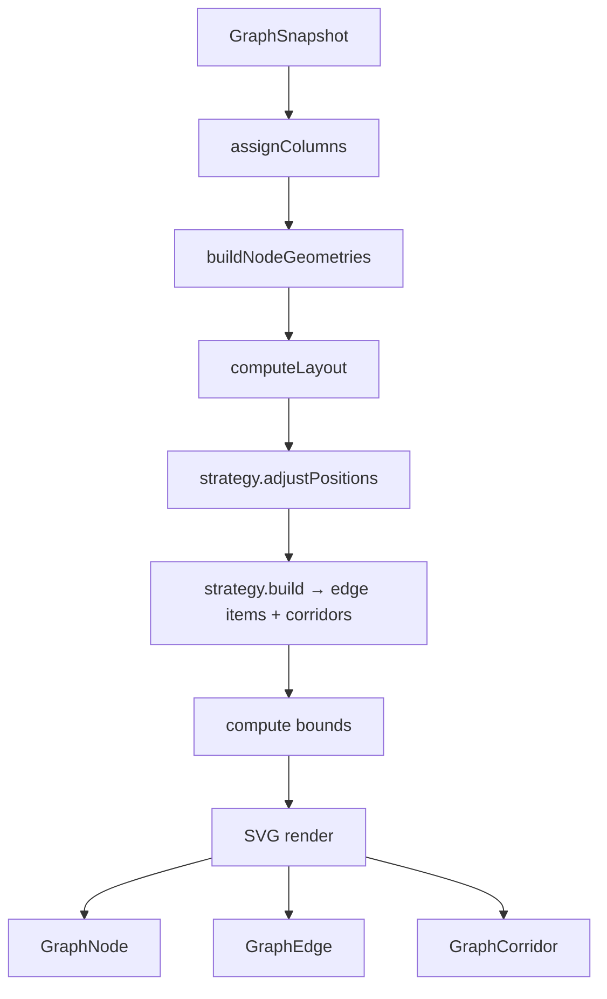

# Rendering pipeline

[TopologyCanvas](../src/components/TopologyCanvas.tsx) converts a `GraphSnapshot`
into an interactive SVG graph. The pipeline is a chain of memoized derivations.



## 1. Column assignment

`assignColumns(nodes, edges)` assigns each node a column by **longest-path from
sources**:

- Column `0` = nodes with no incoming edges (entry points).
- Column `N` = `max(column of all sources) + 1`.

This is deterministic, so a given snapshot always produces the same horizontal
layout — keeping the graph **stable** across live updates.

## 2. Node geometry

`buildNodeGeometries` ([nodeGeometry.ts](../src/helpers/nodeGeometry.ts)) computes
width/height per node. Workload nodes grow vertically with pod count:

```
height = NODE_HEADER_H + podCount * (POD_CARD_H + POD_CARD_GAP) + 2*POD_AREA_PAD
```

Key constants: `NODE_WIDTH=160`, `NODE_HEIGHT=56`, `BORDER_RADIUS=12`,
`BAR_WIDTH=40` (INPUT bar), `HUB_WIDTH=20`.

## 3. Layout

`computeLayout(nodes, nodeCols, nodeGeometries)` places nodes column-by-column,
vertically centered per column, and returns `{ positions, colSpacing, columns }`.

Columns use a **minimum horizontal spacing** (`NODE_WIDTH + 140`) so that
arc-bowed middle nodes (see [strategies](strategies.md)) can never intrude into a
neighbouring column and hide the fan-out edges between them. With many columns the
graph simply grows wider than `CANVAS_W` and relies on pan/zoom — the canvas is not
clipped to that nominal width.

## 4. Strategy adjustment + edge build

The **active [strategy](strategies.md)** can:

- `adjustPositions(...)` — override node positions within columns (optional).
- `build(...)` — produce the render-ready `EdgeRenderItem[]` and
  `CorridorRenderItem[]` (`BuildEdgeResult`). This is where edge paths, colors,
  widths, hub anchoring and corridor trunks are computed.

Edges are rendered **exactly as provided by the backend** — the canvas sets
`normalizedEdges = snapshot.edges` without reordering or synthesizing.

## 5. Bounds + viewport

The canvas computes a bounding box around all nodes, expanded by **70% of the
graph size** in each direction, to give pan headroom. A mask greys out everything
outside the bounds; a dot-grid pattern fills the background.

## 6. SVG composition (z-order)

Within the zoom/pan `<g transform="translate(pan) scale(zoom)">`:

1. Bounds mask + grey outside fill
2. Dashed column separators
3. **Corridors** (trunks) — behind everything
4. **Edge stubs/branches** ([GraphEdge](../src/components/GraphEdge.tsx)) — above
   corridors, below nodes
5. **Nodes** ([GraphNode](../src/components/GraphNode.tsx)) — top

Column labels are pinned as absolutely-positioned DOM (not SVG) at the top of the
screen and follow their column horizontally via
[columnHelpers](../src/helpers/columnHelpers.ts).

## Change animations

Keyframes from [animations.ts](../src/helpers/animations.ts) are injected once at the
canvas root. Because nodes, pods, and edges are keyed by stable ids, React keeps
existing elements mounted across snapshots while new ones mount fresh — so an
entrance keyframe plays exactly once when something **appears** (new node, pod, or
edge). For changes to elements that persist, [useChangeFlash](../src/hooks/useChangeFlash.ts)
remounts a small overlay (edge load pulse, node/pod status ring) to replay a brief
flash whenever the tracked load or status value changes.

## Interaction layers

| Concern | Hook | Behaviour |
| --- | --- | --- |
| Zoom / pan | [useZoomPan](../src/hooks/useZoomPan.ts) | Wheel zoom, drag pan, clamped to bounds |
| Hover / highlight | [useHoverState](../src/hooks/useHoverState.ts) | Highlights connected nodes/edges |
| Selection / focus mode | [useHoverState](../src/hooks/useHoverState.ts) | Click a node → focus mode banner |
| Edge picking | [useEdgePicking](../src/hooks/useEdgePicking.ts) | Distance test against edge polylines/corridors for click target |

`showInactiveEdges` filters out edges with `rps === 0` before picking and render.

Pan updates and edge hover-picking are both coalesced to one update per
animation frame (`requestAnimationFrame`): `useZoomPan` batches drag-pan
`setPan` calls, and `TopologyCanvas` batches the `pickAt` hover scan and skips
the `setHoveredEdgeIds` state write when the hovered edge set is unchanged. This
keeps a burst of `mousemove` events from triggering redundant full re-renders.

## Overlays

- **[EdgePopover](../src/components/EdgePopover.tsx)** — click an edge to see
  protocol / RPS / latency / errors.
- **[NodeDetailModal](../src/components/NodeDetailModal.tsx)** — opens per-node
  detail with history charts (CPU/RAM, request rate, restarts), per-pod metrics,
  and incoming/outgoing edge lists.
- **Focus mode banner** — shown when a node is selected; click × to exit.
